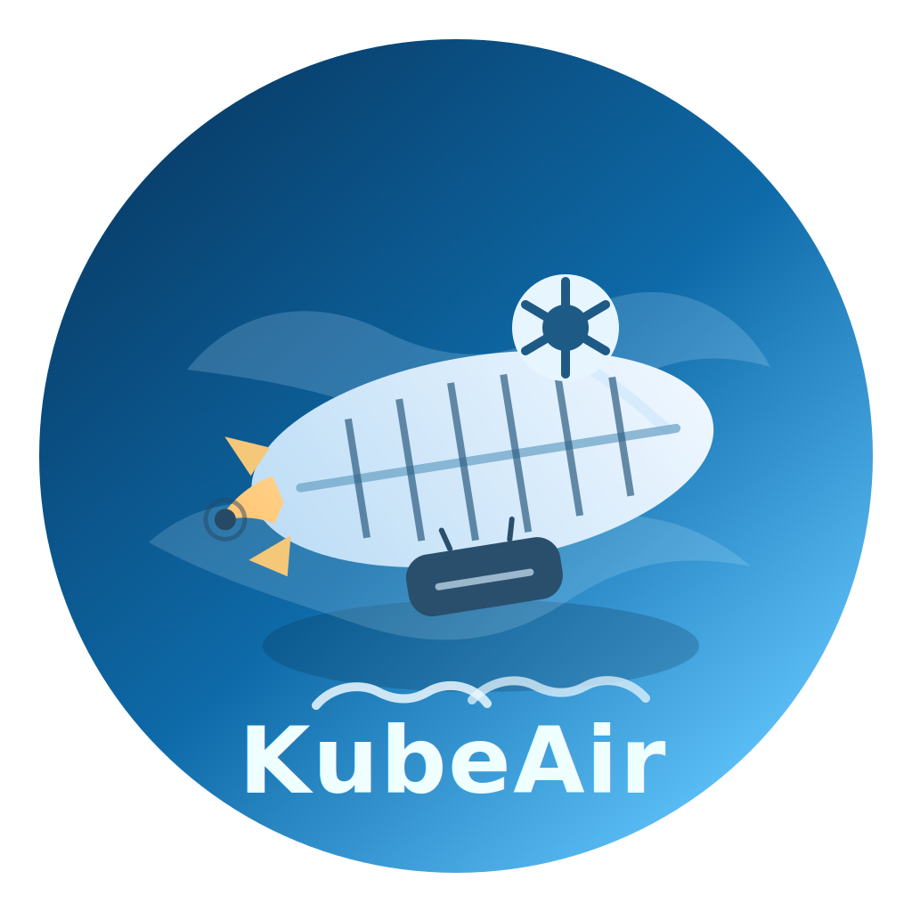

<p align="center">

</p>

[](https://github.com/bencoxford/kubeair/actions/workflows/build.yml)
[](https://github.com/bencoxford/kubeair/actions/workflows/test.yml)
[](LICENSE)

A like-for-like functional Rust reimplementation of the Kubernetes [kubelet](https://github.com/kubernetes/kubernetes/blob/master/cmd/kubelet/kubelet.go), tested against a live kubeadm cluster with ~888 automated tests across unit, integration, conformance, and e2e layers. In the future we may visit other componenets like the kube-apiserver.

> **Note:** This is an independent project and is not affiliated with or endorsed by Kubernetes or CNCF.

## Why?

The Go kubelet is a mature, battle-tested piece of software. KubeAir exists to explore what a production-grade Kubernetes node agent looks like when written in Rust — with a focus on memory efficiency, type safety, and correctness. The goal is not to replace the Go kubelet but to prove it is feasible and to quantify the trade-offs.

## Memory Usage

Measured on a live cluster with 87 pods running:

| Pods          | KubeAir RSS             | Go kubelet (typical)    | Saving           |
| ------------- | ----------------------- | ----------------------- | ---------------- |
| 87 (measured) | 43.2 MB (peak: 53.4 MB) | 207.5 MB (peak: 224 MB) | ~80% less memory |

Projected at scale:

| Pods | KubeAir (est.) | Go kubelet (est.) |
| ---- | -------------- | ----------------- |
| 120  | ~63 MB         | ~210 MB           |
| 200  | ~87 MB         | ~240 MB           |
| 500  | ~177 MB        | ~350 MB           |

## Testing

KubeAir has ~888 automated tests across four layers:

| Layer       | Tests | Description                                    |
| ----------- | ----- | ---------------------------------------------- |
| Unit        | 662   | Per-crate logic tests inside `crates/`       |
| Integration | 70    | Cross-crate behaviour and lifecycle flows      |
| Conformance | 119   | Kubernetes spec compliance (in-process)        |
| E2E         | 38    | Live cluster tests against a real kubeadm node |

E2E tests run against a real kubeadm cluster (Calico CNI, containerd) provisioned inside a Colima VM. They cover cluster health, workload lifecycle, kubectl operations, and containerd API status.

## Kubernetes Compatibility

| KubeAir Version | Kubernetes Version | Status |
| --------------- | ------------------ | ------ |
| `1.33.x`      | 1.33               | Active |

See [docs/development/releases.md](docs/development/releases.md) for the full compatibility and release policy.

## Getting Started

### Prerequisites

- Rust toolchain (pinned in `rust-toolchain.toml` — `rustup` installs it automatically)
- `protoc` (Protocol Buffers compiler) for building the CRI gRPC stubs
- A Linux node joined to a Kubernetes cluster (the kubelet runs as a node agent)

```bash
# macOS
brew install protobuf

# Ubuntu/Debian
sudo apt-get install protobuf-compiler
```

### Build

```bash
# Debug build (native architecture)
cargo build

# Release build (native)
cargo build --release

# Cross-compile for amd64 Linux (requires cargo-zigbuild)
just build amd64

# Cross-compile for arm64 Linux
just build arm64
```

### Run

```bash
./target/release/kubelet \
  --node-name <node-name> \
  --kubeconfig /etc/kubernetes/kubelet.conf \
  --container-runtime-endpoint unix:///run/containerd/containerd.sock
```

Run `./target/release/kubelet --help` for all flags.

### Test

```bash
# All unit and integration tests
just test

# Lint
just lint

# Conformance suite only
just conformance-smoke

# Full end-to-end conformance (requires Colima)
bash hack/e2e/colima-run.sh
```

## Contributing

See [CONTRIBUTING.md](CONTRIBUTING.md).

## Security

See [SECURITY.md](SECURITY.md) for how to report vulnerabilities.

## License

Apache License 2.0 — see [LICENSE](LICENSE).
